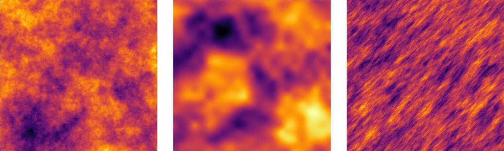

```@meta
CurrentModule = GaussianRandomFields
```
# GaussianRandomFields.jl

*A package for Gaussian random field generation in Julia*

## Introduction

This package provides a collection of Gaussian random field generators, such as the Karhunen-Loève expansion and circulant embedding, for various well-known isotropic covariance functions, including the exponential, Matérn and Gaussian covariance, and some less-known anisotropic covariance functions. Defining your own covariance function is easy. The package supports Gaussian random fields defined on rectangular structured grids, and triangular unstructured (Finite Element) grids.   

Here are some examples!

```@raw html

```

## Installation

`GaussianRandomFields` is a registered package and so can be installed via

```
] add GaussianRandomFields
```

## Usage

- See the [Tutorial](https://PieterjanRobbe.github.io/GaussianRandomFields.jl/dev/tutorial.html) for an introduction on how to use this package (including fancy pictures!)
- See the [API](https://PieterjanRobbe.github.io/GaussianRandomFields.jl/dev/API.html) for a detailed manual
