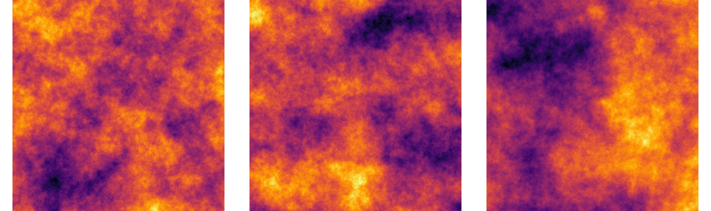

# Summary

Random fields are used to represent spatially-varying uncertainty, and are commonly used as training data in uncertainty quantification and machine learning applications. GaussianRandomFields.jl is a Julia [@bezanson2017] software package to generate and sample from Gaussian random fields. It offers support for well-known covariance functions, such as Gaussian, exponential and Matérn covariances [@bishop2006; @chiles2012; @montero2015], as well as user-defined covariance structures defined on arbitrary domains. The package implements most common methods to generate samples from these random fields, including the Cholesky factorization, the Karhunen-Loève expansion, and the circulant embedding method [@lord2014]. GaussianRandomFields.jl makes use of [Plots.jl](https://github.com/JuliaPlots/Plots.jl) [@PlotsJL] to quickly visualize samples of the random fields.

# Statement of need

Random fields are used by scientists to describe complex patterns and structures emerging in nature. They provide a statistical tool for describing a vast amount of different structures found in various applications such as electronics [@cui2018], geostatistics [@pirot2015], machine learning [@stephenson2006] and cosmology [@chiang2000]. Random fields can be viewed as an extension from random variables to random functions, in the sense that the random field takes random values at each point in the domain where it is defined. Gaussian random fields are particularly attractive, because they only require two parameters to be fully specified: a mean value and a covariance function. GaussianRandomFields.jl provides Julia implementations of Gaussian random fields with stationary separable and non-separable isotropic and anisotropic covariance functions. It has been used in a number of recent works, including [@blondeel2020], [@robbe2021] and [@wu2023].

Other packages for Gaussian random field generation are available in R [@randomfields] and Python [@GSTools]. GaussianRandomFields.jl offers a native Julia implementation. As such, it benefits from the performance advantage of Julia, and provides a convenient unified API for different covariance functions by leveraging multiple dispatch. A particular example are the covariance functions from [KernelFunctions.jl](https://github.com/JuliaGaussianProcesses/KernelFunctions.jl), which can easily be linked to the Gaussian random field generators implemented in this package.

# Usage

The full API of GaussianRandomFields.jl is described in detail in the [documentation](https://pieterjanrobbe.github.io/GaussianRandomFields.jl/stable/). We also provide a [tutorial](https://pieterjanrobbe.github.io/GaussianRandomFields.jl/stable/tutorial) with various examples detailing how to define, sample from, and visualize Gaussian random fields. The following example is an excerpt from the tutorial. We refer to \autoref{fig:samples} for an illustration.

```julia
using GaussianRandomFields, Plots

cov = CovarianceFunction(2, Exponential(.5))
pts = range(0, stop=1, length=1001)
grf = GaussianRandomField(cov, CirculantEmbedding(), pts, pts, minpadding=2001)
heatmap(grf)
```



# Acknowledgements

The author acknowledges the help of David Widmann implementing a dimension-independent variant of the circulant embedding method using `@generated` functions.

# References